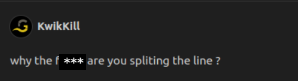
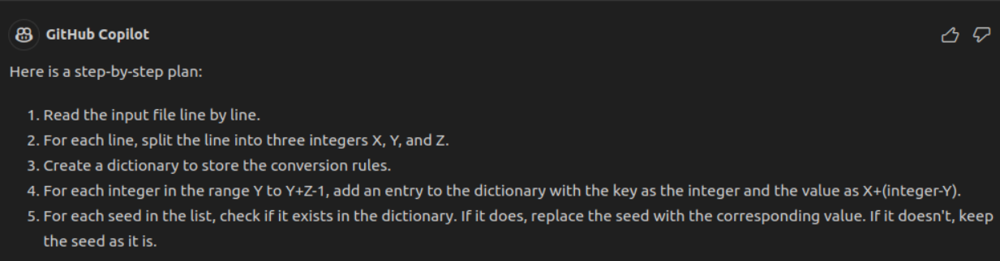

# Advent of codpilote ?

What is this repo ? Why is it here ? What is the goal of this ? What is the meaning of life ?

## Explanation
This repo will host my "advent of codpilote" serie. I will try to solve the exercices of the advent of code 2020 with the help of my friend [Github Copilot](https://copilot.github.com/). 

I'm quite busy this year so I don't have time to solve the advent of code daily. I will try to solve a few exercices every time I have some free time.

The only twist here is there's some rules :
- 1 : I am not allowed to write a single line of code by myself.
- 2 : I am not allowed to modify the code generated by Copilot.
- 3 : I am allowed to interract with every files in the folder (rename, delete, create, etc.) while respecting the two first rules
- 4 : I must ask Copilot which language to use for each exercice and stick to it.
- 5 : I am allowed to change a line to another also written by Copilot.
- 6 : I am allowed to write debug lines only if theses lines are generated by Copilot. I can remove them whenever I want.

I will try to explain the process of solving the exercice and the way I use Copilot to help me.
Codes in this repo are the result of this experiment and have a lot of bad practices. I don't recommend using them in any way.

### Table of content

- [Day 1](#day-1)
    - [Problem](#problem)
    - [Part 1](#part-1)
    - [Part 2](#part-2)
    - [Conclusion of day 1](#conclusion-of-day-1)
- [Day 2](#day-2)
    - [Problem](#problem-1)
    - [Part 1](#part-1-1)
    - [Part 2](#part-2-1)
    - [Conclusion of day 2](#conclusion-of-day-2)
- [Day 3](#day-3)
    - [Problem](#problem-2)
    - [Part 1](#part-1-2)
    - [Part 2](#part-2-2)
    - [Conclusion of day 3](#conclusion-of-day-3)

## Day 1
### Problem

The first exercice was about finding digits in every lines of a file and summing them. The instructions can be found [here](https://adventofcode.com/2023/day/1).

### Part 1

I first asked Copilot which language to use as specified by the rules while rewording the problem in a way that would be easier for Copilot to understand.

Then, according to rule number 3, I created a python file and asked Copilot to solve the problem for me.

I had to rename the input file to `input.txt` as Copilot was looking for it but when I ran the code, it worked like a charm.

The complete code can be found [here](day-1/main.py).

### Part 2

The second part of the exercice was the same as the first one but digit could sometimes be written in full letters.

And god, Copilot was a bit lost on this one.

The first idea used by Copilot was to use a regex to find the digits in the file. It was a good idea but it was not working as expected. By checking if a patern was matching `(one|two|three|four|five|six|seven|eight|nine|zero\d)` it was not able to find digit when they were merged like "twone" (which is 21).

I then tried to make him used a loop but it's first idea was to use a single loop which only results in the same problem as before.

So I decided to make him use two loops, one looping over the char of the line and the other trying if every words made from the current char and the next `n` one was a digit. It was hard to explain to Copilot but it worked.

You can find below screenshots of me trying to explain to Copilot what I wanted him to do.

### Conclusion of day 1

This first exercice was not that hard except the second part that buged Copilot a lot but it was a good way to see how Copilot was working depending on the explanation and how I could use it to solve the advent of code.

## Day 2
### Problem

The second exercice was about finding bags content from random drawings. The instructions can be found [here](https://adventofcode.com/2023/day/2).

### Part 1

As for the first day, I summarized the problem in a way that would be easier for Copilot to understand and asked him which language to use. He chose python again (luckily, I'm not a big fan of python).

Then, I created a python file and asked Copilot to solve the problem for me. He was quite good at it like the first part of day 1 but he was only returning the first bag that could match the rules.

I then asked him to change from id "Game 1" to only integer 1 and to sum every possible bags. He then returned the right answer.

### Part 2

The second part of the exercice was not as hard for copilot to find as the first day. He was able to find the right answer after a few modifications.

The biggest problem I encountered was because of a misconception I had about the exercice. But copilot was able to find the right answer after I explained to him the good way to do it.

### Conclusion of day 2

This second exercice was overall easier than the first one. Copilot was able to find the right answer quite easily and I didn't have to explain to him what to do. I just had to change a few things to make him understand what I wanted him to do. I think it's because the problem was easier to understand for Copilot than the first one and had less edge cases.

## Day 3
### Problem

The third exercice was about finding the numbers adjacent to a symbol (#, $, +, -, etc.) in a grid. The instructions can be found [here](https://adventofcode.com/2023/day/3).

### Part 1

For the language choice, Copilot chose python again. I think he likes it.

This exercice was really hard for Copilot to understand. I had to explain to him with a lot of different examples what I wanted him to do but he was always returning the wrong answer because of some edge cases or things he was not able to understand.

Classics mistakes were :
- Not understanding that this had to be viewed as a grid and not a string.
- Adding the dot to the symbol to find the adjacent numbers (so he was finding every numbers).
- Not checking verticaly and diagonaly neighbors.

But after a lot of tries, and a lot of explanations, he was able to come up with a good piece of code.

### Part 2 

For this one, I almost had a breakdown. Copilot was not able to understand what I wanted him to do. I had to explain to him a lot of times with exemple, with counter exemple,...

He had a lot of problems with understanding that it is numbers and not digits, that numbers had to be adjacent to the symbol,...

But ! After a lot of tries, he was able to find the right answer as always.

### Conclusion of day 3

This exercice was the hardest for now. Copilot was barely able to understand what I wanted him to do and I had to explain to him a lot of times. I think it's because the problem was not really well explained and had a lot of edge cases. A lot of steps were needed to find a good piece of code.

## Day 4
### Problem

The fourth exercice was about finding same numbers between two list (winning number and... The other). The instructions can be found [here](https://adventofcode.com/2023/day/4).

### Part 1

Pff, still python. I'm starting to get bored of this language. But python it is.

This exercice was looking easy because we only had to find the same numbers between two list and the score of the card was 2^{same numbers length}. 

The easiest way to do this was to use a set to find the intersection between the two lists and then calculate the score.
I missed the fact that the score was not 2^{same numbers length} but 2^{same numbers length - 1} but after a few tries, I managed to get the right answer.

### Part 2

Rha, this one was annoying. Not hard though but annoying. My idea was to keep in memory the numbers of each cards and then increment by the current number of a card the next {score} cards numbers.
You don't get it ? Don't worry, neither did Copilot.

I tried to describe the problem as best as I could but It was not enough. It took 6 tries to get the right answer. Which is not that bad. My first message was the following :

And I had to redirected him a few times to get the right answer.

### Conclusion of day 4

This exercice was really fine. Easy part 1 and a bit harder part 2 but nothing too hard. Copilot did well for the first one but I was a bit disappointed by the second one. It may be because I was unclear in my explanations but I prefer to blame Copilot.

## Day 5
### Problem

The fifth exercice was about chaining maps describes by rules (input, output, range). The instructions can be found [here](https://adventofcode.com/2023/day/5).

This one seems a bit harder than the previous ones and I'm not sure how Copilot will handle it. It may be a bit hard to explain to him and take a lot of time.

### Part 1

Copilot chose python again. One day he'll change. I hope.

Parsing the file was hard. At first he thinked that there was only one conversion dictionary and that the input was always the same. I had to explain to him that there was a list of conversion dictionaries and that the input was also include in the input.

But when I gave him an input example, he came up with a good piece of code. A very good one. I just had to remind him that the input was also containing the seeds.

And for the conversion you may ask ? It was a one shot. He was really in a good shape for this one.

### Part 2

Oh god. My free time... Where was it gone ? It took me 2 hours to complete this part. 

The strategy on this part 2 was to represent the seeds as a range and then to convert them to location by splitting the ranges when overlapping. 

Copilots struggled on a lot of points :
- First of all, he wanted to represent the seeds individually and not as a range. Of course, I do not own a supercomputer with 2TB of RAM so It was not a good idea.
- Then, he tried to create a function with both return and yield. This is because I asked him to modify an existing function to make it work with a generator.
- The overlapping... It was so hard to make him understand how it was supposed to work. 
- And finally, the easiest but the last one he understood was to just add the range back when there was no rule to apply.

### Conclusion of day 5

The part 1 of the day 5 was really simple for Copilot, maybe because of a good description of the problem. The part 2 was a hell maybe because of an unclear conception from me. A lot of bad codes (semantically and syntactically) were generated and I had to tell him to go back to the beginning a lot of times. It was a hard exercice but with time, I'm still in the challenge.